* Table of Contents
{:toc}

--------------------------------------------------------------------------------------------------------------------

## **Acknowledgements**

* This project is based on the AddressBook-Level3 project created by the [SE-EDU initiative](https://se-education.org).
* Libraries used: [JavaFX](https://openjfx.io/), [Jackson](https://github.com/FasterXML/jackson), [JUnit5](https://github.com/junit-team/junit5)

--------------------------------------------------------------------------------------------------------------------

## **Setting up, getting started**

Refer to the guide [_Setting up and getting started_](SettingUp.md).

--------------------------------------------------------------------------------------------------------------------

## **Design**

:bulb: **Tip:** The `.puml` files used to create diagrams in this document can be found in the [diagrams](https://github.com/AY2223S1-CS2103-F09-1/tp/tree/master/docs/diagrams/) folder. Refer to the [_PlantUML Tutorial_ at se-edu/guides](https://se-education.org/guides/tutorials/plantUml.html) to learn how to create and edit diagrams.

### Architecture

The ***Architecture Diagram*** given above explains the high-level design of the App.

Given below is a quick overview of main components and how they interact with each other.

**Main components of the architecture**

**`Main`** has two classes called [`Main`](https://github.com/AY2223S1-CS2103-F09-1/tp/tree/master/src/main/java/seedu/address/Main.java) and [`MainApp`](https://github.com/AY2223S1-CS2103-F09-1/tp/tree/master/src/main/java/seedu/address/MainApp.java). It is responsible for,
* At app launch: Initializes the components in the correct sequence, and connects them up with each other.
* At shut down: Shuts down the components and invokes cleanup methods where necessary.

[**`Commons`**](#common-classes) represents a collection of classes used by multiple other components.

The rest of the App consists of four components.

* [**`UI`**](#ui-component): The UI of the App.
* [**`Logic`**](#logic-component): The command executor.
* [**`Model`**](#model-component): Holds the data of the App in memory.
* [**`Storage`**](#storage-component): Reads data from, and writes data to, the hard disk.

**How the architecture components interact with each other**

The *Sequence Diagram* below shows how the components interact with each other for the scenario where the user issues the command `delete -s i/A0123456X`.

Each of the four main components (also shown in the diagram above),

* defines its *API* in an `interface` with the same name as the Component.
* implements its functionality using a concrete `{Component Name}Manager` class (which follows the corresponding API `interface` mentioned in the previous point.

For example, the `Logic` component defines its API in the `Logic.java` interface and implements its functionality using the `LogicManager.java` class which follows the `Logic` interface. Other components interact with a given component through its interface rather than the concrete class (reason: to prevent outside component's being coupled to the implementation of a component), as illustrated in the (partial) class diagram below.

The sections below give more details of each component.

### UI component

The **API** of this component is specified in [`Ui.java`](https://github.com/AY2223S1-CS2103-F09-1/tp/tree/master/src/main/java/seedu/address/ui/Ui.java)

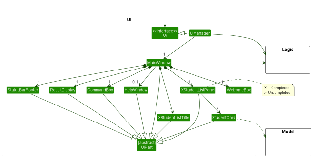

The UI consists of a `MainWindow` that is made up of parts e.g.`CommandBox`, `ResultDisplay`, `CompletedStudentListPanel`, `StatusBarFooter` etc. All these, including the `MainWindow`, inherit from the abstract `UiPart` class which captures the commonalities between classes that represent parts of the visible GUI.

The `UI` component uses the JavaFx UI framework. The layout of these UI parts are defined in matching `.fxml` files that are in the `src/main/resources/view` folder. For example, the layout of the [`MainWindow`](https://github.com/AY2223S1-CS2103-F09-1/tp/tree/master/src/main/java/seedu/address/ui/MainWindow.java) is specified in [`MainWindow.fxml`](https://github.com/AY2223S1-CS2103-F09-1/tp/tree/master/src/main/resources/view/MainWindow.fxml)

The `UI` component,

* executes user commands using the `Logic` component.
* listens for changes to `Model` data so that the UI can be updated with the modified data.
* keeps a reference to the `Logic` component, because the `UI` relies on the `Logic` to execute commands.
* depends on some classes in the `Model` component, as it displays `Student` object residing in the `Model`.

### Logic component

**API** : [`Logic.java`](https://github.com/AY2223S1-CS2103-F09-1/tp/tree/master/src/main/java/seedu/address/logic/Logic.java)

Here's a (partial) class diagram of the `Logic` component:

How the `Logic` component works:
1. When `Logic` is called upon to execute a command, it uses the `FypManagerParser` class to parse the user command.
1. This results in a `Command` object (more precisely, an object of one of its subclasses e.g., `AddStudentCommand`) which is executed by the `LogicManager`.
1. The command can communicate with the `Model` when it is executed (e.g. to add a student).
1. The result of the command execution is encapsulated as a `CommandResult` object which is returned back from `Logic`.

The Sequence Diagram below illustrates the interactions within the `Logic` component for the `execute("delete -s i/A0123456X")` API call.

:information_source: **Note:** The lifeline for `DeleteStudentCommandParser` should end at the destroy marker (X) but due to a limitation of PlantUML, the lifeline reaches the end of diagram.

Here are the other classes in `Logic` (omitted from the class diagram above) that are used for parsing a user command:

How the parsing works:
* When called upon to parse a user command, the `FypManagerParser` class creates an `XYZCommandParser` (`XYZ` is a placeholder for the specific command name e.g., `AddStudentCommandParser`) which uses the other classes shown above to parse the user command and create a `XYZCommand` object (e.g., `AddStudentCommand`) which the `FypManagerParser` returns back as a `Command` object.
* All `XYZCommandParser` classes (e.g., `AddStudentCommandParser`, `DeleteStudentCommandParser`, ...) inherit from the `Parser` interface so that they can be treated similarly where possible e.g, during testing.

### Model component
**API** : [`Model.java`](https://github.com/AY2223S1-CS2103-F09-1/tp/tree/master/src/main/java/seedu/address/model/Model.java)

The `Model` component,

* stores the FYP manager data i.e., all `Student` objects (which are contained in a `UniqueStudentList` object).
* stores the currently 'selected' `Student` objects (e.g., results of a search query) as a separate _filtered_ list which is exposed to outsiders as an unmodifiable `ObservableList<Student>` that can be 'observed' e.g. the UI can be bound to this list so that the UI automatically updates when the data in the list change.
* stores a `UserPref` object that represents the user’s preferences. This is exposed to the outside as a `ReadOnlyUserPref` objects.
* does not depend on any of the other three components (as the `Model` represents data entities of the domain, they should make sense on their own without depending on other components)

:information_source: **Note:** An alternative (arguably, a more OOP) model is given below. It has a `Tag` list in the `FypManager`, which `Student` references. This allows `FypManager` to only require one `Tag` object per unique tag, instead of each `Student` needing their own `Tag` objects. 

### Storage component

**API** : [`Storage.java`](https://github.com/AY2223S1-CS2103-F09-1/tp/tree/master/src/main/java/seedu/address/storage/Storage.java)

The `Storage` component,
* can save both FYP manager data and user preference data in json format, and read them back into corresponding objects.
* inherits from both `FypManagerStorage` and `UserPrefStorage`, which means it can be treated as either one (if only the functionality of only one is needed).
* depends on some classes in the `Model` component (because the `Storage` component's job is to save/retrieve objects that belong to the `Model`)

### Common classes

Classes used by multiple components are in the `jeryl.fyp.commons` package.

--------------------------------------------------------------------------------------------------------------------

## **Implementation**

This section describes some noteworthy details on how certain features are implemented.

### Adding a student to the FYP manager
This feature allows professors as users to keep track of students that are supervised under, as well as the project each student is working on.

#### Implementation details
The add student feature is facilitated by `AddStudentCommandParser` and `AddStudentCommand`. The operation is exposed in the `Model` interface as `Model#addStudent()`.

Given below is an example usage scenario and how the add student mechanism behaves at each step:
1. The user enters the add student command and provides the name of the student, the student ID, the project name, and the student's email.
2. `FypManagerParser` creates a new `AddStudentCommandParser` after preliminary processing of user input.
3. `AddStudentCommandParser` then processes the input again and creates an `AddStudentCommand`.
4. `LogicManager` executes the `AddStudentCommand` using the `LogicManager#execute()` method.
5. `AddStudentCommand` checks if the student has existed before using `Model#hasStudent()`.
6. If the student is not inside the student list yet, `AddStudentCommand` calls `Model#addStudent()` and passes the student as the parameter.
7. Finally, `AddStudentCommand` creates a `CommandResult` and returns it to `LogicManager` to complete the command.

The following sequence diagram shows how the add student command works:

:information_source: **Note:** The lifeline for `UndoCommand` should end at the destroy marker (X) but due to a limitation of PlantUML, the lifeline reaches the end of diagram.

#### Design considerations
An add student command is designed to add a single student along with its detail particulars such as one's student ID, student name, project name, and email. These details are the important details every professor needs from a student so that the professor can understand the work of the student and is able to contact the student when needed.

### Adding a deadline to a student in the FYP manager
This feature allows professors as users to keep track of students deadlines that are supervised under.

#### Implementation details
The add student feature is facilitated by `AddDeadlineCommandParser` and `AddDeadlineCommand`. The operation is exposed in the `Model` interface as `Model#addDeadline()`.

Given below is an example usage scenario and how the add deadline mechanism behaves at each step:
1. The user enters the add deadline command and provides the name of the deadline, the student ID, and deadline date(optional parameter).
2. `FypManagerParser` creates a new `AddDeadlineCommandParser` after preliminary processing of user input.
3. `AddDeadlineCommandParser` then processes the input again and creates an `AddDeadlineCommand`.
4. `LogicManager` executes the `AddDeadlineCommand` using the `LogicManager#execute()` method.
5. `AddDeadlineCommand` checks if the deadline has existed before using `Model#hasDeadline()`.
6. If the deadline is not inside the student deadline list yet, `AddDeadlineCommand` calls `Model#addDeadline()` and passes the student and deadline as the parameter.
7. Finally, `AddDeadlineCommand` creates a `CommandResult` and returns it to `LogicManager` to complete the command.

The following sequence diagram shows how the add deadline command works:

:information_source: **Note:** The lifeline for `AddDeadlineCommand` should end at the destroy marker (X) but due to a limitation of PlantUML, the lifeline reaches the end of diagram.

The following activity diagram summarizes what happens when a user executes an add deadline command.

#### Design considerations

An add deadline command is designed to add a single deadline along with its deadline date to a particular student. This helps the professor to keep track of which deadline is assigned to which student easily.

### Deleting a student from the FYP manager
This feature allows professors to delete students who have dropped their FYP

#### Implementation details

The delete student feature is facilitated by `DeleteStudentCommandParser` and `DeleteStudentCommand`. The operation is exposed in the `Model` interface as `Model#DeleteStudent()`.

Given below is an example usage scenario and how the delete student mechanism behaves at each step:
1. The user enters delete student command and provides the student ID of student to be deleted.
2. `FYPManagerParser` creates a new `DeleteStudentCommandParser` after preliminary processing of user input.
3. `DeleteStudentCommandParser` creates a new `DeleteStudentCommand` based on the processed input.
4. `LogicManager` executes the `DeleteStudentCommand`.
5. `DeleteStudentCommand` calls `Model#getFilteredStudentList()` to get the list of student with FYP, and then gets the student at the specified index using the unique studentId.
6. `DeleteStudentCommand` calls `Model#DeleteStudent()` and passes the studentID, and return student deleted as parameters.
7. Finally, `DeleteStudentCommand` creates a `CommandResult` and returns it to `LogicManager` to complete the command.

The following sequence diagram shows how delete student command works:

:information_source: **Note:** The lifeline for `DeleteStudentCommand` should end at the destroy marker (X) but due to a limitation of PlantUML, the lifeline reaches the end of diagram.

The following activity diagram summarizes what happens when a user executes a delete student command.

#### Design considerations

The delete student command is designed to be used in conjunction with find student command. For instance, the user would first use find student using project name to find the student taking FYP using `find machine`
to find students taking machine learning projects before doing `delete -s i/A0123456X` to remove student from FYP Manager.

This integration between delete student command with find student command is important because FYPManager can store large number of students with FYP, making it not fesiable for users to scroll through the list.
By utilizing find student, users can find the student with only partial information and retrieve the student ID Using this student ID, users can delete the student from the FYPManager once he/she drops the FYP.

#### Implementation details

The delete deadline feature is facilitated by `DeleteDeadlineCommandParser` and `DeleteDeadlineCommand`. The operation is exposed in the `Model` interface as `Model#DeleteDeadline()`.

Given below is an example usage scenario and how the delete deadline mechanism behaves at each step:

1. The user enters delete deadline command and provides the student ID and rank of deadline to be deleted.
2. `FYPManagerParser` creates a new `DeleteDeadlineCommandParser` after preliminary processing of user input.
3. `DeleteDeadlineCommandParser` creates a new `DeleteDeadlineCommand` based on the processed input.
4. `LogicManager` executes the `DeleteDeadlineCommand`.
5. `DeleteDeadlineCommand` calls `Model#getFilteredStudentList()` to get the list of student with FYP, and then gets the student at the specified index using the unique studentId.
6. `DeleteDeadlineCommand` calls `Model#DeleteDeadline()` and passes the studentID, and rank of deadline and return deadline deleted as parameters.
7. Finally, `DeleteStudentCommand` creates a `CommandResult` and returns it to `LogicManager` to complete the command.

The following sequence diagram shows how delete deadline command works:

:information_source: **Note:** The lifeline for `DeleteDeadlineCommand` should end at the destroy marker (X) but due to a limitation of PlantUML, the lifeline reaches the end of diagram.

The following activity diagram summarizes what happens when a user executes a delete deadline command.

#### Design considerations

The delete deadline command is designed to be used in conjunction with find student command. For instance, the user would first use find student using project name to find the student taking FYP using `find machine`
to find students taking machine learning projects before doing `delete -d i/A0123456X r/1` to remove student from FYP Manager.

This integration between delete deadline command with find student command is important because FYPManager can store large number of students with FYP, making it not fesiable for users to scroll through the list.
By utilizing find student, users can find the student with only partial information and retrieve the student ID Using this student ID, users can delete the deadline from the FYPManager once he/she drops the deadline task.

### \[Proposed\] Undo/redo feature

#### Proposed Implementation

The proposed undo/redo mechanism is facilitated by `VersionedFypManager`. It extends `FypManager` with an undo/redo history, stored internally as an `fypManagerStateList` and `currentStatePointer`. Additionally, it implements the following operations:

* `VersionedFypManager#commit()` — Saves the current FYP manager state in its history.
* `VersionedFypManager#undo()` — Restores the previous FYP manager state from its history.
* `VersionedFypManager#redo()` — Restores a previously undone FYP manager state from its history.

These operations are exposed in the `Model` interface as `Model#commitFypManager()`, `Model#undoFypManager()` and `Model#redoFypManager()` respectively.

Given below is an example usage scenario and how the undo/redo mechanism behaves at each step.

Step 1. The user launches the application for the first time. The `VersionedFypManager` will be initialized with the initial FYP manager state, and the `currentStatePointer` pointing to that single FYP manager state.

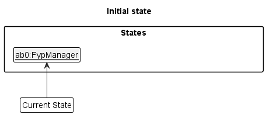

Step 2. The user executes `delete 5` command to delete the 5th student in the FYP manager. The `delete` command calls `Model#commitFypManager()`, causing the modified state of the FYP manager after the `delete 5` command executes to be saved in the `fypManagerStateList`, and the `currentStatePointer` is shifted to the newly inserted FYP manager state.

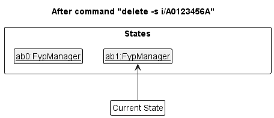

Step 3. The user executes `add n/David …​` to add a new student. The `add` command also calls `Model#commitFypManager()`, causing another modified FYP manager state to be saved into the `fypManagerStateList`.

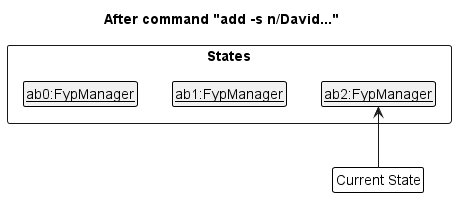

:information_source: **Note:** If a command fails its execution, it will not call `Model#commitFypManager()`, so the FYP manager state will not be saved into the `fypManagerStateList`.

Step 4. The user now decides that adding the student was a mistake, and decides to undo that action by executing the `undo` command. The `undo` command will call `Model#undoFypManager()`, which will shift the `currentStatePointer` once to the left, pointing it to the previous FYP manager state, and restores the FYP manager to that state.

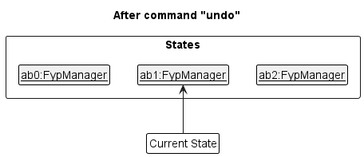

:information_source: **Note:** If the `currentStatePointer` is at index 0, pointing to the initial FypManager state, then there are no previous FypManager states to restore. The `undo` command uses `Model#canUndoFypManager()` to check if this is the case. If so, it will return an error to the user rather
than attempting to perform the undo.

The following sequence diagram shows how the undo operation works:

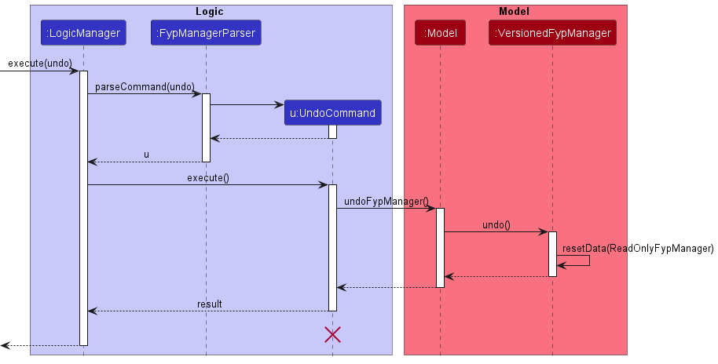

:information_source: **Note:** The lifeline for `UndoCommand` should end at the destroy marker (X) but due to a limitation of PlantUML, the lifeline reaches the end of diagram.

The `redo` command does the opposite — it calls `Model#redoFypManager()`, which shifts the `currentStatePointer` once to the right, pointing to the previously undone state, and restores the FYP manager to that state.

:information_source: **Note:** If the `currentStatePointer` is at index `fypManagerStateList.size() - 1`, pointing to the latest FYP manager state, then there are no undone FypManager states to restore. The `redo` command uses `Model#canRedoFypManager()` to check if this is the case. If so, it will return an error to the user rather than attempting to perform the redo.

Step 5. The user then decides to execute the command `Exit`. Commands that do not modify the FYP manager, such as `Exit`, will usually not call `Model#commitFypManager()`, `Model#undoFypManager()` or `Model#redoFypManager()`. Thus, the `fypManagerStateList` remains unchanged.

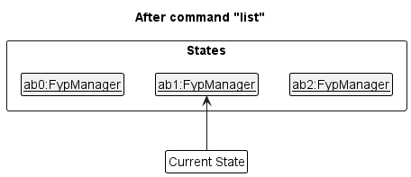

Step 6. The user executes `clear`, which calls `Model#commitFypManager()`. Since the `currentStatePointer` is not pointing at the end of the `fypManagerStateList`, all FYP manager states after the `currentStatePointer` will be purged. Reason: It no longer makes sense to redo the `add n/David …​` command. This is the behavior that most modern desktop applications follow.

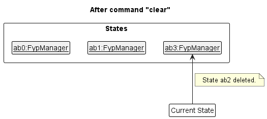

The following activity diagram summarizes what happens when a user executes a new command:

#### Design considerations:

**Aspect: How undo & redo executes:**

* **Alternative 1 (current choice):** Saves the entire FYP manager.
  * Pros: Easy to implement.
  * Cons: May have performance issues in terms of memory usage.

* **Alternative 2:** Individual command knows how to undo/redo by
  itself.
  * Pros: Will use less memory (e.g. for `delete`, just save the student being deleted).
  * Cons: We must ensure that the implementation of each individual command are correct.

_{more aspects and alternatives to be added}_

### `Mark` Feature
#### Proposed Implementation
The proposed MarkCommand Feature marks the Project Status of an FYP project as one of 3 possible statuses
{***YTS***, ***IP***, ***DONE***}. Currently these are the only 3 statuses supported, although more may be implemented
later on if there are other meaningful statuses.

The MarkCommand Feature sets a default status of `YTS` whenever a new FYP project is added to the FYP Manager, and the
MarkCommand allows us to accordingly the project Status to either `IP` if the student is still
working on the FYP project, or `DONE` once the FYP project has been completed.

Given below is an example usage scenario and how MarkCommand is utilised:

Step 1: The Professor launches the application for the first time. `FypManager` will be initialised with the
current FypManager state.

Step 2: The Professor tries adding a student to the FypManager by executing the command
`add i/A0123456G ...`. Note that here we have set the default project Status to be `YTS` since
the project has just been added.

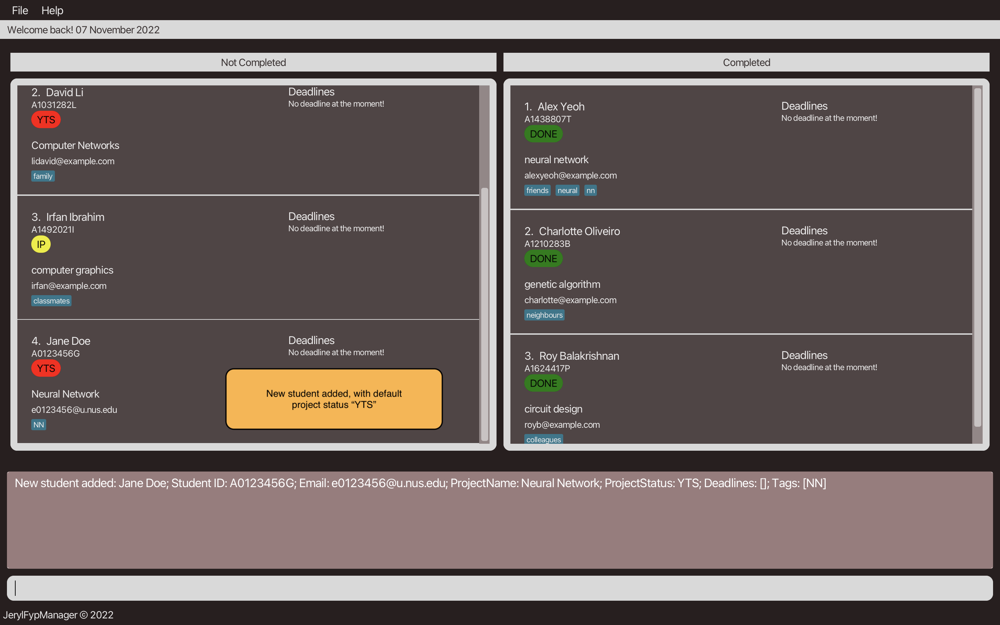

Step 3: Suppose that the student Jane Doe has now started on the project. The Professor wishes to update the
project status for Jane to be `IP` instead of `YTS`, hence the Professor will execute the command
`mark i/A0123456G s/IP` to update the status accordingly.

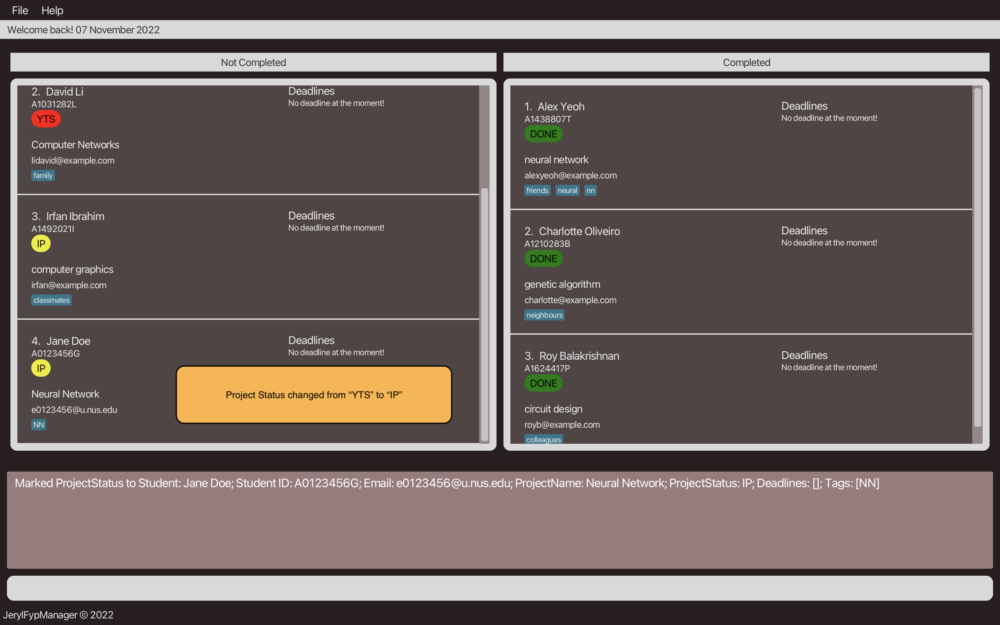

:information_source: **Note:** If the student ID is incorrect or the
status is not one of the statuses {`YTS`, `IP`, `DONE`}, then the command will not be executed and an appropriate
error message will be shown.

The following sequence diagram shows how the MarkCommand operation works:

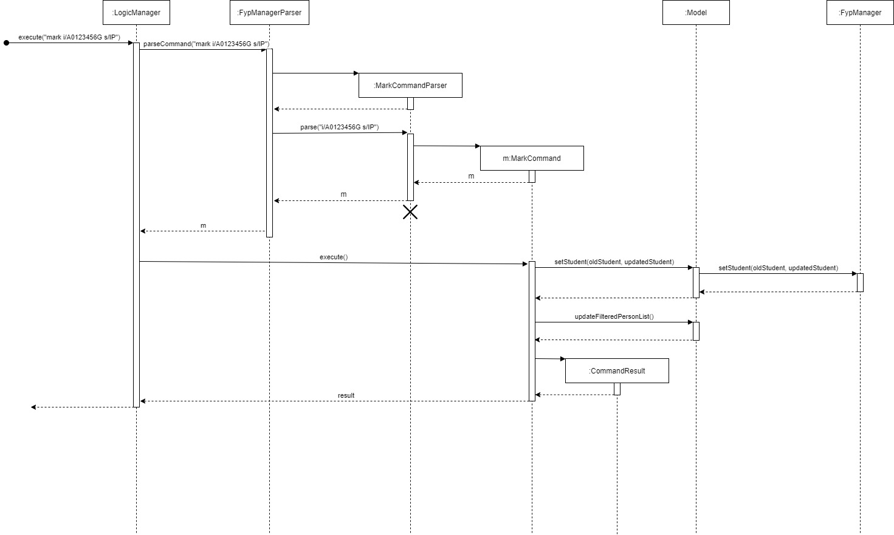

The following activity diagram illustrates what happens when a user executes `MarkCommand`:

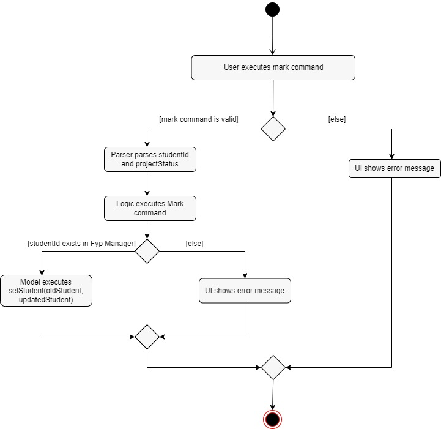
#### Design considerations:

**Implementation Choice: Why MarkCommand is implemented this way**
* We have only chosen to consider 3 general statuses {`YTS`, `IP`, `DONE`} since these are very general
labels that the Professor can use to identify the current status of an FYP project. This makes it very user-friendly
  since there are a fixed number of statuses that can be used.

* We have also used the studentId to uniquely identify the project of the student the Professor
is trying to find. Here we have made an assumption that there the StudentId uniquely identifies the FYP project
  (i.e. a student can only take exactly 1 FYP project under a certain Professor)
  This makes the Mark Command relatively easy to use in practice.

**Other Alternatives:**

* **Alternative 1:** Extend the Edit command to include the MarkCommand
    * Pros: Easier to implement.
    * Cons: No clear distinction between tags and project status

#### Implementation details

The edit student feature is facilitated by `EditCommandParser` and `EditCommand`. The operation is exposed in the `Model` interface as `Model#Edit()`.

Given below is an example usage scenario and how the edit student mechanism behaves at each step:

1. The user enters delete deadline command and provides the student ID and other parameters(eg: student name, project name) to be changed to.
2. `FYPManagerParser` creates a new `EditCommandParser` after preliminary processing of user input.
3. `EditCommandParser` creates a new `EditCommand` based on the processed input.
4. `LogicManager` executes the `EditCommand`.
5. `EditCommand` calls `Model#getFilteredStudentList()` and gets the student list.
6. `EditCommand` calls `Model#getIndexByStudentId(i)` and passes the studentId, and gets the desired student.
7. `EditCommand` calls `EditCommand#createEditedStudent(student, parameters)` and passes the student and parameters to be edited to.
8. `EditCommand` calls `EditCommand#setStudent(studentToEdit, editedStudent)` and passes the student and previous student object to be replaced.
9. `EditCommand` calls `EditCommand#updateFilteredStudentList(PREDICATE_SHOW_ALL_STUDENTS)` and updates the studentList.
10. Finally, `EditCommand` creates a `CommandResult` and returns it to `LogicManager` to complete the command.

The following sequence diagram shows how edit student command works:

:information_source: **Note:** The lifeline for `EditCommand` should end at the destroy marker (X) but due to a limitation of PlantUML, the lifeline reaches the end of diagram.

The following activity diagram summarizes what happens when a user executes am edit command.

#### Design considerations

The edit deadline command is designed to be used in conjunction with find student command. For instance, the user would first use find student using project name to find the student taking FYP using `find machine`
to find students taking machine learning projects before doing `edit A0123456X p/AI` to edit student from FYP Manager.

This integration between edit command with find student command is important because FYPManager can store large number of students with FYP, making it not fesiable for users to scroll through the list.
By utilizing find student, users can find the student with only partial information and retrieve the student ID Using this student ID, users can edit the student attributes from the FYPManager.

###  `Help` Feature
#### Proposed Implementation
The proposed `Help` Feature provides the professor or students with useful information on how to optimally make use of this Jeryl app.
The `Help` feature mechanism is facilitated by `HelpCommand` and `HelpCommandParser`. `HelpCommand` extends from the abstract class `Command`
while `HelpCommandParser` extends from the interface `Parser`.
More specific features like `HelpAddCommand` and `HelpDeleteCommand` extend from `HelpCommand` to serve for certain specific help requests.
To summarize, it implements the following operation:
* `HelpCommand#execute()` — oversees the execution process for `HelpCommand`.
* `HelpAddCommand#execute()` — oversees the execution process for `HelpAddCommand`.
* `HelpDeleteCommand#execute()` — oversees the execution process for `HelpDeleteCommand`.
* `HelpFindCommand#execute()` — oversees the execution process for `HelpFindCommand`.
* `HelpListCommand#execute()` — oversees the execution process for `HelpListCommand`.
* `HelpMarkCommand#execute()` — oversees the execution process for `HelpMarkCommand`.

Given below is an example usage scenario of `HelpCommand`:
1. The user enters the `help` command or also provides the specific command of interest.
2. `FypManagerParser` creates a new `HelpCommandParser` after preliminary check of user input.
3. `HelpCommandParser` creates a new `HelpCommand` based on the processed input.
4. `LogicManager` executes the `HelpCommand` using the `LogicManager#execute()` method.
5. `HelpCommand` shows help message, and then creates a `CommandResult` and returns it to `LogicManager` to complete the command.
6. If it is just `HelpCommand`, `HelpWindow` would pop up with a link to JERYL user guide on it.

The following sequence diagram shows how the help command works:

:information_source: **Note:** The lifeline for `HelpCommand` should end at the destroy marker (X) but due to a limitation of PlantUML, the lifeline reaches the end of diagram.

The following activity diagram summarizes what happens when a user executes am help command.

###  `Exit` Feature
#### Proposed Implementation
The proposed `Exit` Feature allows the professor to list all FYP students in the FYP Manager.
The `Exit` feature mechanism is facilitated by `ExitCommand`. It extends from the abstract class `Command`.
To summarize, it implements the following operation:
* `ListCommand#execute()` — oversees the execution process for `ExitCommand`.

Given below is an example usage scenario of `ExitCommand`:
1. The user enters the `Exit` command
2. `FypManagerParser` creates a new `ExitCommand` after preliminary check of user input.
3. `LogicManager` executes the `ExitCommand` using the `LogicManager#execute()` method.
4. `ExitCommand` updates a `ObservableList<Student>`, and then creates a `CommandResult` and returns it to `LogicManager` to complete the command.

The following sequence diagram shows how the list command works:

The following activity diagram summarizes what happens when a user executes a list command:

### `Find` Feature
#### Proposed Implementation

The proposed FindCommand Feature allows the user to find for specific keywords in certain fields. The current
implementation supports finding keywords in four fields:
1) `StudentId`
2) `StudentName`
3)  `Tags` (accorded to a student)
4) `ProjectName`.

This is a new enhancement in v1.3, as older iterations only supported finding projects by their titles,
while the newest iteration supports finding projects by any of the above four fields. We hope that this allows the user
to be able to filter the projects more efficiently. (for instance, by project names:
***NeuralNetwork***, ***Blockchain***, etc.)

The FindCommand feature takes in a specified field (one of the four aforementioned fields), and a keyword specified
by the user. FypManager then returns a list of projects whose field contains the keyword inputted.

Note that the keyword is case-insensitive, can contain arbitrary spacing, and is field-specific.

Given below is an example usage scenario and how FindCommand is utilised:

Step 1. The user launches the application for the first time. The 'FypManager' will be initialised with its
'FypManager' state.

Step 2: The user finds a project by keying in `find -p tree` to find all projects whose name contains the keyword
`tree`. FypManager returns a list of projects whose names contain the `tree` keyword.

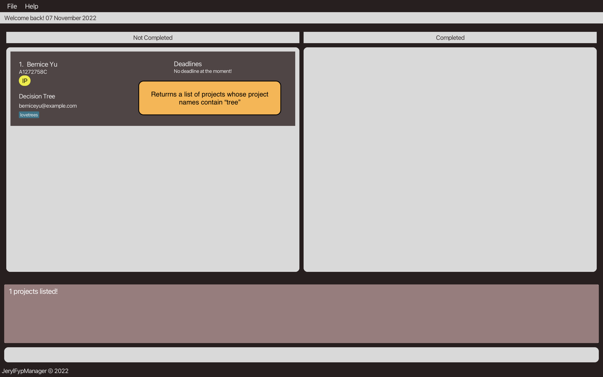

Step 3: Suppose that the user wants to find another project with keyword `blockchain`. The user keys in
`find -p blockchain` to find all projects whose names contain the keyword `blockchain`. FypManager returns an empty 
list, as there is no project whose project name contains `blockchain`.

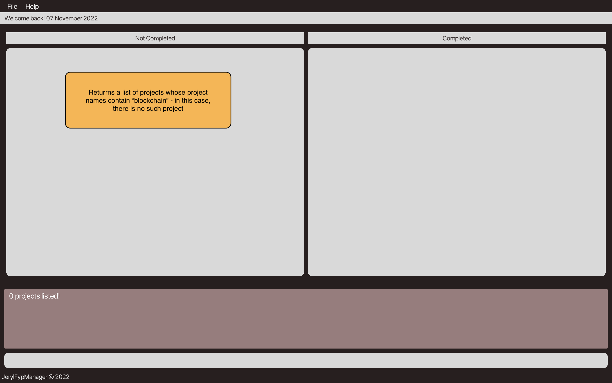

Step 4: The user is unsure of the correct names of the projects that he wants to find, and decides to find for 
multiple keywords `network / design`. The user keys in `find -p network / design` to find all projects whose names
contain either the keywords `network` or `design`. FypManager returns a list of projects whose names contain at least
one of the two keywords.

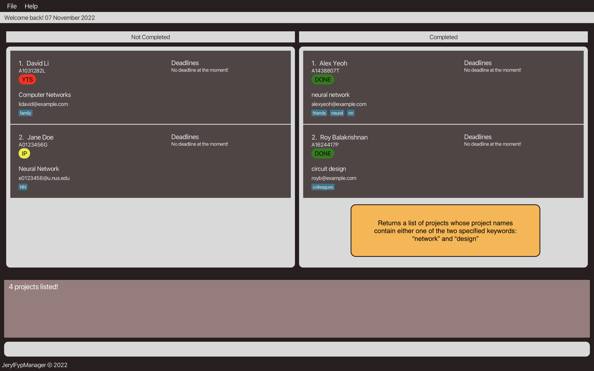

The following sequence diagram shows how the FindCommand operation works:

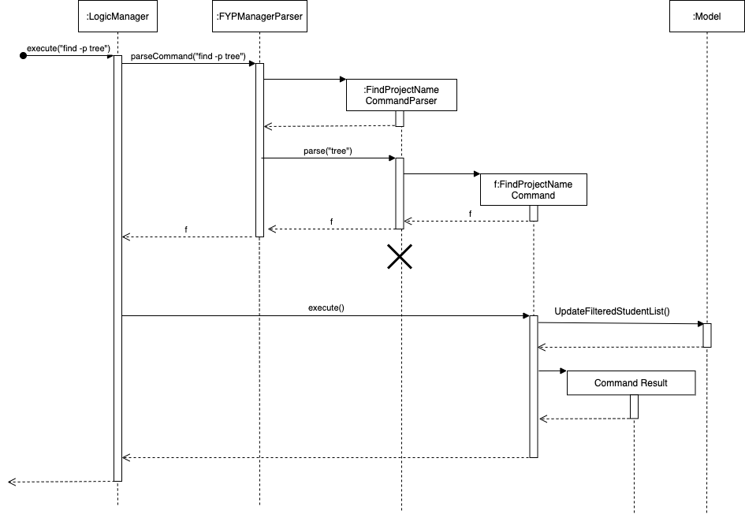

The following activity diagram summarizes what happens when a user executes a list command:

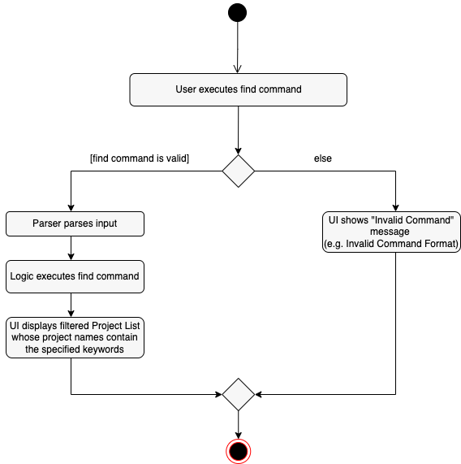

#### Design considerations:

**Implementation Choice: Why FindCommand is implemented this way**
* We have implemented FindCommand to find a student's project by four different fields. This is practical, since
  different users would want to find the relevant projects by different fields, making this a more versatile tool to use
  as a FypManager tool.

* We have allowed the user to be able to search using different keywords (so long as they are separated by ***/*** ),
  which lets the user be more flexible in his/her search criteria.

* Furthermore, we have made the input more flexible by making it case-insensitive, helping users who are not particularly
  careful with their input of capital-cases or lower-cases. This also mimics real-life query engines, which usually
  allow users to type their search keywords without fretting about whether there are upper-cases in the keyword.

**Other Alternatives:**

* **Alternative 1:** Extend the FindCommand by allowing the user to search by fields other than project name
    * Pros: Allows the users to search using more fields instead of ProjectName alone.
    * Cons: Harder to implement. And requires inclusion of a suffix.

***[v1.3 update: the above has been achieved as of this update. :) ]***

* **Alternative 2:** Allow the user to search for their keywords across all fields without specifying a field
    * Pros: More comprehensive search for projects with the required keyword.
    * Cons: Much harder to implement, as it requires a field-less search.

### `Sort` Feature
#### Proposed Implementation

This feature allows professors to sort the FYP projects by their project name, or by
the project status in the order {YTS, IP, DONE}.

#### Implementation details
The `Sort` feature is facilitated by 2 main Commands: `SortProjectNameCommand` and `SortProjectStatusCommand`.
Both of these commands extend from the abstract `Command`class. Note that we have fixed the sorting order
of `SortProjectStatusCommand` to be sorted in the order {YTS,IP,DONE} since projects that have YTS are more urgent,
hence we have placed them at the front of our FYP manager, followed by those that are IP, and finally
those that are DONE which are of the least urgency.

We give an example usage scenario of `SortProjectNameCommand` and `SortProjectStatusCommand`
* `SortProjectNameCommand`
    1. The user enters `sort -p` if he wishes to execute the `SortProjectNameCommand`
    2. FypManagerParser creates a new `SortProjectNameCommand` after preliminary check of user input.
    3. `LogicManager` executes the `SortProjectNameCommand` using the `LogicManager#execute()` method.
    4. `SortProjectNameCommand` creates a `CommandResult` and returns it to `LogicManager`, which will be
       identified as a `SortProjectNameCommand` so that our `MainWindow` will show the sorted List.

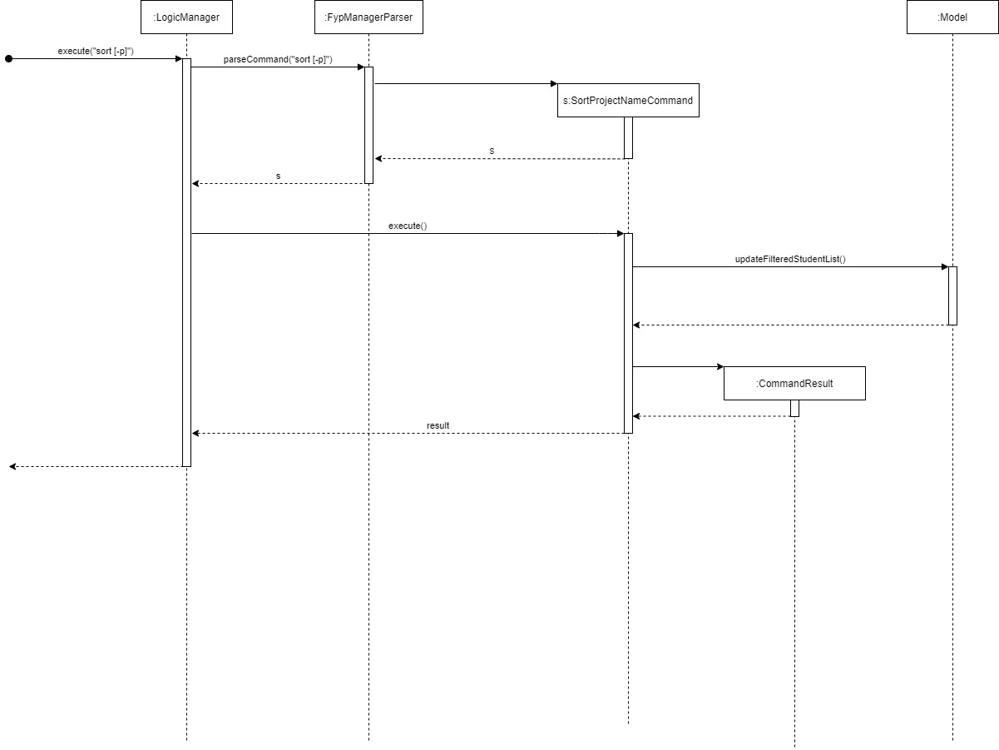

* `SortProjectStatusCommand`
    1. The user enters `sort -s` if he wishes to execute the `SortProjectStatusCommand`
    2. FypManagerParser creates a new `SortProjectNameCommand` after preliminary check of user input.
    3. `LogicManager` executes the `SortProjectStatusCommand` using the `LogicManager#execute()` method.
    4. `SortProjectStatusCommand` creates a `CommandResult` and returns it to `LogicManager`, which will be
        identified as a `SortProjectStatusCommand` so that our `MainWindow` will show the sorted List.

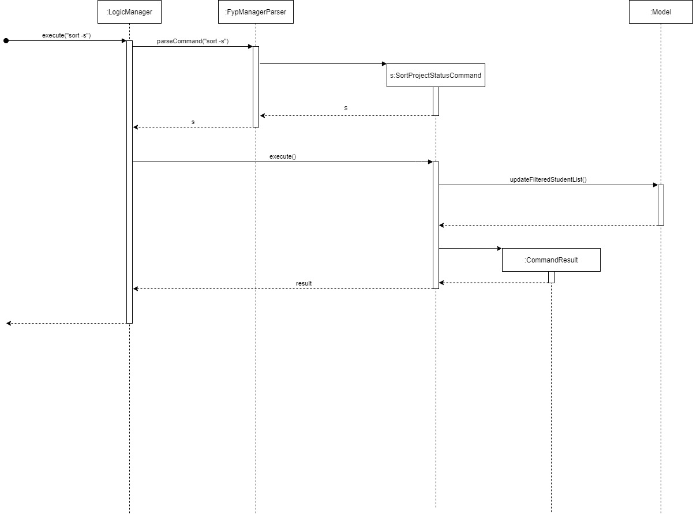

The following activity diagram summarizes what happens when the user runs a `SortCommand`:

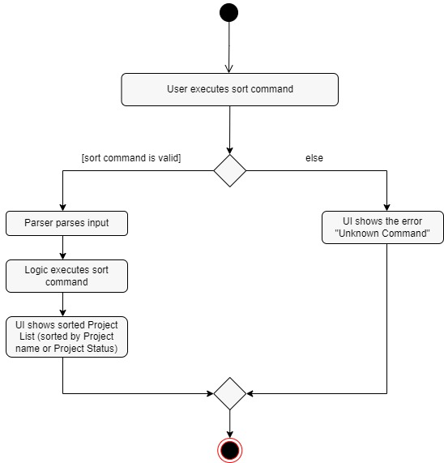

#### Future Implementations
* Sorting of deadlines could be considered as well

###  `Exit` Feature
#### Proposed Implementation
The proposed `Exit` Feature allows the professor to exit the FYP Manager.
The `Exit` feature mechanism is facilitated by `ExitCommand`. It extends from the abstract class `Command`.
To summarize, it implements the following operation:
* `ExitCommand#execute()` — oversees the execution process for `ExitCommand`.

Given below is an example usage scenario of `ExitCommand`:
1. The user enters the `Exit` command.
2. `UiManager` calls `MainWindow#fillInnerParts()`.
3. `MainWindow#fillInnerParts()` executes a `executeCommand()` and creates a `CommandResult`.
4. `LogicManager` executes the `ExitCommand` using the `LogicManager#execute()` method.
4.1. `FypManagerParser` will parse the command using `parseCommand` and generate
4.2. `ExitCommand` then creates a `CommandResult` and returns it to `MainWindow` to complete the command.
4.3. `StorageManager` will save the record using method `StorageManager#saveFypManager()`.
5. `handleExit()` is then executed to hide the main window.

The following sequence diagram shows how the list command works:

--------------------------------------------------------------------------------------------------------------------

## **Documentation, logging, testing, configuration, dev-ops**

* [Documentation guide](Documentation.md)
* [Testing guide](Testing.md)
* [Logging guide](Logging.md)
* [Configuration guide](Configuration.md)
* [DevOps guide](DevOps.md)

--------------------------------------------------------------------------------------------------------------------

## **Appendix: Requirements**

### Product scope

**Target user profile**:

* NUS SoC Professors taking on and managing FYP students doing projects using SoC
* prefer desktop apps over other types
* can type fast
* prefers typing to mouse interactions
* is reasonably comfortable using CLI apps

**Value proposition**: To provide a platform for easier access to SoC professors to their students’ FYP status, rather than via plain e-mail correspondences.

### User stories

Priorities: High (must have) - `* * *`, Medium (nice to have) - `* *`, Low (unlikely to have) - `*`

| Priority | As a/an …​                                     | I can …​                                                                                                  | So that I can…​                                                                             |
|----------|------------------------------------------------|-----------------------------------------------------------------------------------------------------------|---------------------------------------------------------------------------------------------|
| `* * *`  | responsible SoC professor                      | clear/mark done a project                                                                                 | provide timely updates for my students to track their FYP progress                          |
| `* * *`  | first time user                                | view a list of commands that I can try as well as the details of each command                             | quickly start to manage my students’ FYPs using this system/app                             |
| `* * *`  | no-time-to-waste SoC professor                 | search the projects using specific keywords                                                               | access the progress of projects of interest with just a few clicks                          |
| `* * *`  | organised SoC professor                        | remove students if they dropped a FYP that was under me                                                   | keep the consolidated list of FYPs neat and organised                                       |
| `* * *`  | organised SoC professor                        | remove students if they completed a FYP that was under me, and move them to a “completed” FYP list        | keep the consolidated list of FYPs neat and organised [coming soon]                         |
| `* * *`  | SoC professor                                  | add students if they are taking their FYP under me                                                        | keep track of those FYP projects under me easily                                            |
| `* * *`  | student with many email accounts               | update my e-mail address when I change on the app                                                         | be easily contacted by my professors when they need to find me [coming soon]                |
| `* * *`  | SoC professor                                  | view the list of all students taking their FYP under me                                                   | get to know more information about my own students                                          |
| `* *`    | responsible FYP student                        | check my upcoming deadlines with an option to see yet-to-submit deliverables                              | avoid missing any submission deadlines by accident [coming soon]                            |
| `* *`    | SoC professor                                  | view the progress updates that my students upload                                                         | deliberate about what the next course of action should be [coming soon]                     |
| `* *`    | eager student                                  | receive feedback promptly, i.e. read comments and suggestions from my professor ASAP                      | set a clear direction for my FYP in advance [coming soon]                                   |
| `* *`    | responsible FYP student                        | update my FYP progress through the app                                                                    | inform my professor on my progress [coming soon]                                            |
| `* *`    | critical student                               | provide feedbacks on my FYP guidance and evaluations by my professor                                      | help the FYP management team to further improve [coming soon]                               |
| `* *`    | helpful SoC professor                          | put tags (e.g. “Ahead of time”, “Up to task”, “Behind schedule”) on my student's FYP                      | clearly indicate my student's progress relative to the timeline [coming soon]               |
| `* *`    | non-confrontational (i.e. shy) student         | push certain tags (e.g. “Assistance required!”, “Unable to complete :(”) to the application               | gather my professor’s attention without direct confrontation [coming soon]                  |
| `* *`    | friendly SoC professor   　　　                   | share my availability with my students                                                                    | be booked on consultation slots by my students [coming soon]                                |
| `* *`    | troubled student   　　　                         | request for help from my professors by clicking on a button and indicating it’s urgency                   | alert the professor that I might need some assistance and how urgent it is [coming soon]    |
| `*`      | fun-seeking professor/FYP student              | send “stickers” (similar to Telegram stickers) or emoji                                                   | have a fun experience while using the app [coming soon]                                     |
| `*`      | responsible FYP student                        | update my availability slots on the app                                                                   | let my professor know when I will be available to meet [coming soon]                        |
| `*`      | well-versed SoC professor                      | sort my student’s FYP based on what specialisation they are taking                                        | organise the FYPs better [coming soon]                                                      |
| `*`      | meticulous SoC professor   　　　                 | see student's FYP sorted by research area first, followed by alphabetical order                           | gain quick and easy access to the details required [coming soon]                            |
| `*`      | proactive FYP student   　　　                    | view available consultation slots with my professor on the app                                            | easily plan my consultation sessions with my professor [coming soon]                        |
| `*`      | forgetful FYP student   　　　                    | be updated in real time on any comments tagged with varying urgency levels                                | fix any urgent mistakes for clarification as my Professor goes through my FYP [coming soon] |
| `*`      | organised SoC professor   　　　                  | set a deadline for one or more projects                                                                   | advise my students on what to be prioritized [coming soon]                                  |
| `*`      | proactive student   　　　                        | turn off (or on) the notification email from professors at any time                                       | avoid emails if I have already done the submissions [coming soon]                           |
| `*`      | busy SoC professor   　　　                       | see my students’ project titles and summaries at one glance                                               | save time from clicking into different links to access them [coming soon]                   |
| `*`      | insecure FYP student   　　　                     | ring or notify my professor(s) for help via the platform                                                  | get the immediate help that I require [coming soon]                                         |
| `*`      | clear-minded SoC professor   　　　               | filter the student’s FYP projects based on what specialisation they are doing (e.g. network research, AI) | gain quick access to the relevant FYP projects by categories [coming soon]                  |
| `*`      | organized SoC professor   　　　                  | have a separate tab to store all the files that I send to or receive from my students                     | refer to the related files easily [coming soon]                                             |
| `*`      | punctual SoC professor   　　　                   | be alarmed of the upcoming meetings when it’s almost the time                                             | join them on time. (e.g. 5 minutes before) [coming soon]                                    |
| `*`      | SoC professor who values maintainability   　　　 | integrate some existing SoC-made softwares within                                                         | have more familiarity with the platform [coming soon]                                       |
| `*`      | constructive SoC professor   　　　               | comment and suggest on my students’ current work                                                          | give my feedback in a fast and easy way [coming soon]                                       |
| `*`      | eager student   　　　                            | see the pending task with the next earliest deadline set by my professor                                  | know what I need to do next for my FYP [coming soon]                                        |
| `*`      | automation-loving SoC professor   　　　          | send auto emails to students with upcoming deadlines                                                      | remind them to work on the tasks by the deadline [coming soon]                              |

*{More to be added}*

--------------------------------------------------------------------------------------------------------------------
### Use cases

(For all use cases below, the **System** is the `JerylFypManager` and the **Actor** is the `Professor`, unless specified otherwise)

**1. Use case: UC01 - Adding FYP**

**Preconditions: Professor knows the details of FYP to be added**

**MSS**

1.  Professor requests to add a student FYP into the list.
2.  JerylFypManager adds the FYP details.

    Use case ends.

**Extensions**

* 1a. The request given is invalid.
  * 1a1. JerylFypManager shows an error message.
  * 1a2. Professor enters a new request.

  Steps 1a1-1a2 are repeated until the request entered is correct.

  Use case resumes from step 2.

**2. Use case: UC02 - Searching Keyword**

**Preconditions: Professor can recall part of the project name**

**MSS**

1.  Professor wants to track the status of certain project(s).
2.  Professor searches the project(s) using a specified keyword.
3.  JerylFypManager displays the search results with a brief summary for each project.

    Use case ends.

**Extensions**

* 2a. The keyword given does not match any project name.
    * 2a1. JerylFypManager shows an error message.
    * 2a2. Professor tries again with another keyword.

  Steps 2a1-2a2 are repeated until some projects are matched.

  Use case resumes from step 3.

**3. Use case: UC03 - Marking Project Status**

**Guarantees:**
* Project Status goes from “Yet to Start” (YTS) to “In Progress”  (IP); alternatively, from “In Progress” (IP) to “Done” (DONE).

**Preconditions: Existence of said FYP in database**

**MSS**

1.  Professor wants to modify the status of his student’s project, and he/she specifies the desired status change.
2.  JerylFypManager toggles the status of the project.

    Use case ends.

**Extensions**

* 1a. Professor’s input of Student’s ID / Status Tag is incorrect (e.g. misspell), or Professor is accessing FYP that does not exist.
    * 1a1. JerylFypManager shows an error message.
    * 1a2. Professor keys in his input again.

    Steps 1a1-1a2 are repeated until the request entered is correct.

  Use case resumes from step 2.

**4. Use case: UC04 - Removing FYP**

**Preconditions: Professor can recall the name/ID of the FYP**

**MSS**

1.  Professor requests to remove a student FYP from the list.
2.  JerylFypManager removes the FYP details.

    Use case ends.

**Extensions**

* 1a. The request given is invalid.
    * 1a1. JerylFypManager shows an error message.
    * 1a2. Professor enters a new request.

  Steps 1a1-1a2 are repeated until the request entered is correct.

  Use case resumes from step 2.

**5. Use case: UC05 - Help List**

**Preconditions: Nil**

**MSS**

1.  Professor requests from JerylFypManager to list all possible commands.
2.  JerylFypManager shows the list of possible commands and the format to be entered in.

    Use case ends.

**Extensions**

* Nil

**6. Use case: UC06 - List FYPs**

**Preconditions: There exist FYP(s) in JerylFypManager**

**MSS**

1.  Professor requests for JerylFypManager to show the list of FYPs.
2.  JerylFypManager shows a list of FYPs to the professor.

    Use case ends.

**Extensions**

* 2a. There are currently no FYPs that the professor is overseeing.
    * 2a1. JerylFypManager tells the professor that he is currently not overseeing any FYPs.

  Use case ends.

**7. Use case: UC07 - Exit JerylFypManager**

**Preconditions: Nil**

**MSS**

1.  Professor requests to exit JerylFypManager.
2.  JerylFypManager shows exit message.
3.  JerylFypManager application is closed.

    Use case ends.

**Extensions**

* Nil

*{More to be added}*

--------------------------------------------------------------------------------------------------------------------
### Non-Functional Requirements

1.  Should work on any _mainstream OS_ as long as it has Java `11` or above installed.
2.  User with above average typing speed for regular English text (i.e. not code, not system admin commands) should be able to accomplish most of the tasks faster using commands than using the mouse.
3.  The system should respond in at most 1 second.
4.  A user with no coding background should be able to use JerylFypManager.
5.  Notification sent to users upon updates to FYPs.
6.  Personal details of students should only be accessible by supervising professor.
7.  System should be able to support the whole SoC cohort (around 1500 users) at the same time.
8.  JerylFypManager is accessible 24/7.

*{More to be added}*

--------------------------------------------------------------------------------------------------------------------
### Glossary

<!-- Reused from https://ay2122s2-cs2103t-w14-1.github.io/tp/UserGuide.html with minor modifications -->

| Term                           | Explanation                                                                                     |
|--------------------------------|-------------------------------------------------------------------------------------------------|
| Java                           | A programming language which was used to built FypManager.                                      |
| Command-line Interface (CLI)   | An interface which involves the users typing text and executing it as commands.                 |
| Graphical User Interface (GUI) | An interface which involves the users clicking buttons and selecting options from the menu bar. |
| Final Year Project (FYP)       | A project taken by students in their final year of study.                                       |
| School of Computing (SoC)      | One of the faculties inside the National University of Singapore.                               |
| JerylFypManager                | A platform used by SoC Professors for supervising student's FYP.                                |
| Professor                      | An academic staff of SoC who is supervising a student's FYP.                                    |
| Student                        | A SoC student who is taking FYP in their final year of study.                                   |

--------------------------------------------------------------------------------------------------------------------

## **Appendix: Instructions for manual testing**

Given below are instructions to test the app manually.

:information_source: **Note:** These instructions only provide a starting point for testers to work on;
testers are expected to do more *exploratory* testing.

### Launch and shutdown

1. Initial launch

   1. Download the jar file and copy into an empty folder

   1. Double-click the jar file Expected: Shows the GUI with a set of sample contacts. The window size may not be optimum.

1. Saving window preferences

   1. Resize the window to an optimum size. Move the window to a different location. Close the window.

   1. Re-launch the app by double-clicking the jar file. 
       Expected: The most recent window size and location is retained.

1. _{ more test cases …​ }_

### Deleting a student

1. Deleting a student while all students are being shown

   1. Prerequisites: List all students using the `Exit` command. Multiple students in the list.

   1. Test case: `delete 1` 
      Expected: First contact is deleted from the list. Details of the deleted contact shown in the status message. Timestamp in the status bar is updated.

   1. Test case: `delete 0` 
      Expected: No student is deleted. Error details shown in the status message. Status bar remains the same.

   1. Other incorrect delete commands to try: `delete`, `delete x`, `...` (where x is larger than the list size) 
      Expected: Similar to previous.

1. _{ more test cases …​ }_

### Saving data

1. Dealing with missing/corrupted data files

   1. _{explain how to simulate a missing/corrupted file, and the expected behavior}_

1. _{ more test cases …​ }_
